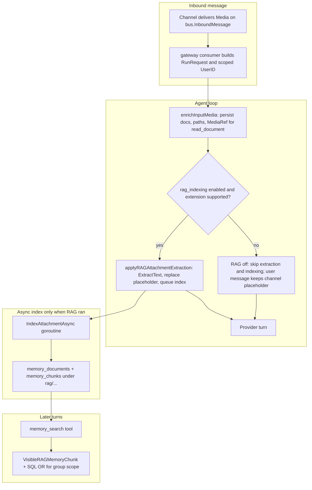

# RAG attachment indexing — implementation guide

This document describes how GoClaw implements **RAG-style attachment handling**: text extraction for the current LLM turn, asynchronous indexing into the memory store, and **scoped visibility** during `memory_search`. It is aimed at contributors and operators who need to reason about cross-chat behavior (DM vs group).

## Goals

1. **Turn-time**: When supported documents arrive in a user message, optionally replace channel placeholders with extracted text so the model can answer without calling `read_document` for that file.
2. **Retrieval-time**: Store chunked text under predictable paths so `memory_search` can recall it later, with rules that distinguish **private (per-user) DM uploads** from **group-shared uploads**.

## Feature toggle (opt-in)

RAG is **off by default**. It is enabled per agent via `other_config`:

```json
{
  "rag_indexing": {
    "enabled": true,
    "supported_types": [".md", ".txt", ".csv", ".pdf"]
  }
}
```

- **`enabled`**: Must be explicitly `true` (missing or `false` keeps indexing disabled).
- **`supported_types`**: Filled or refreshed by the gateway when an agent update passes through `rag.EnrichOtherConfigWithRAG` (HTTP/WS), based on `rag.CheckDeps()` (Python/pandoc availability on the host).

Relevant code: `internal/store/agent_store.go` (`ParseRAGIndexingConfig`), `internal/rag/merge.go`, UI: `ui/web/src/pages/rag/rag-page.tsx`.

## High-level flow

`enrichInputMedia` **always** persists documents and wires `read_document` refs. **`applyRAGAttachmentExtraction`** is always invoked when there are document refs, but it **returns immediately** if `rag_indexing.enabled` is not true (or the extension is not in `supported_types`). No extraction, no placeholder replacement, and **no `rag/...` indexing** on that turn.



`memory_search` still works for normal memory files (`MEMORY.md`, `memory/*.md`, etc.) when RAG is disabled; only **new** attachment chunks under `rag/` are absent for those turns.

## Where the agent loop is hooked

1. **`enrichInputMedia`** (`internal/agent/loop_input_media.go`) runs during input preparation for each turn.
2. It persists uploaded files, attaches document `MediaRef`s to context (`tools.WithMediaDocRefs`), enriches the last user message with paths, then **always calls** **`applyRAGAttachmentExtraction`** when there is at least one document ref (the function no-ops when RAG is disabled).

```82:89:internal/agent/loop_input_media.go
	// 2b. Collect document MediaRefs (historical + current) for read_document tool.
	if docRefs := collectRefsByKind(messages, mediaRefs, "document"); len(docRefs) > 0 {
		ctx = tools.WithMediaDocRefs(ctx, docRefs)
		// Enrich the last user message with persisted file paths so skills can access
		// documents via exec (e.g. pypdf). Only for current-turn refs (just persisted).
		l.enrichDocumentPaths(messages, mediaRefs)
		l.applyRAGAttachmentExtraction(ctx, req, messages, mediaRefs)
	}
```

3. **`applyRAGAttachmentExtraction`** (`internal/agent/loop_rag_attachments.go`) does nothing unless `l.ragIndexing.Enabled` **and** each file passes `SupportsExt` (extension in `supported_types`).

## Extraction and LLM injection

### Placeholder replacement (binary-like docs)

Channels typically inject a short hint such as:

`[File: report.pdf — use read_document tool to analyze this file]`

If that placeholder appears in the **last user message** content and the ref matches (by display name or basename), the loop:

1. Calls **`rag.ExtractText`** (`internal/rag/extractor.go`) — reads `.md`/`.txt`/`.csv` directly; optional tools for PDF, Office, etc.
2. Replaces the hint with an **`ExtractedContentBlock`** (filename + `<extracted_content>...</extracted_content>`) so the model sees the text **in the same turn**.

### Inline text attachments

For `.md`, `.txt`, `.csv`, if there was no placeholder match, the loop may read the file and index it without changing visible content (index-only path).

### Async indexing

After successful extraction (or inline read), **`rag.IndexAttachmentAsync`** schedules a background goroutine that:

- Computes **`UploadScope`** from `SessionKey` + memory user (`ParseScope`).
- Writes a virtual document via **`MemoryStore.PutDocument`** and **`IndexDocument`** under a path under `rag/...` (see below).

```41:68:internal/rag/indexer.go
// IndexAttachmentAsync indexes supported attachments under rag/dm/ or rag/group/{groupID}/.
// Runs in a background goroutine; errors are logged only.
func IndexAttachmentAsync(p IndexAttachmentParams) {
	if p.Memory == nil || !p.HasMemory || p.Text == "" {
		return
	}
	// ...
	scope := ParseScope(p.SessionKey, p.MemoryUser)
	if scope.OwnerID == "" {
		slog.Warn("rag.index.skip_no_owner", "session", p.SessionKey)
		return
	}
	// ...
}
```

## Path layout and scope (`ParseScope`)

Session keys follow `agent:{agentKey}:{channel}:direct:{peer}` or `agent:{agentKey}:{channel}:group:{chatId}` (and variants such as forum topics). **`ParseScope`** scans the `rest` segment for the first `:group:` token to decide whether the upload is **group-scoped**.

| Session kind | `memory_documents.path` prefix | `GroupID` (for search) |
|--------------|--------------------------------|-------------------------|
| DM / direct peer | `rag/dm/{basename}` | empty |
| Group chat | `rag/group/{channel}:group:{chatId}/{basename}` | e.g. `telegram:group:-100...` |

```16:52:internal/rag/scope.go
// ParseScope derives RAG visibility paths from the canonical session key and uploader user id.
func ParseScope(sessionKey, userID string) UploadScope {
	_, rest := sessions.ParseSessionKey(sessionKey)
	// ...
	// finds "group" in rest → GroupID = channel + ":group:" + groupChatID
}
```

**Row ownership (`memory_chunks.user_id`)**: Indexing uses **`store.MemoryUserID(ctx)`** at upload time (same as normal memory), which is **`UserIDFromContext`** when memory is not shared. That value is channel-dependent (see next section).

## Gateway identity: why DM uploads differ from group `UserID`

For **group** chats, the gateway often replaces the per-message `UserID` with a **chat-scoped** id so memory and context files are isolated per room, while **`SenderID`** stays the real sender (see `cmd/gateway_consumer_normal.go`).

Examples:

- Telegram group: `UserID` may become `group:telegram:{chatId}`; `SenderID` remains the numeric Telegram user id.
- Discord guild: with `guild_id` metadata, `UserID` may become `guild:{guildId}:user:{senderId}`.
- Slack / Feishu / others: same pattern — `SenderID` is the stable per-user id from that channel.

This matters for RAG because **DM uploads** are stored with `user_id` = the user’s normal id, while **group turns** use the scoped `UserID` for rows that belong to that room.

## Search: `memory_search` and RAG visibility

The **`memory_search`** tool (`internal/tools/memory.go`) passes:

- **`searchUserID`**: `MemoryUserID(ctx)` with fallback to `UserIDFromContext` — aligns SQL row filtering with the current run’s memory scope.
- **`RAGGroupID`**: `ParseScope(sessionKey, searchUserID).GroupID` — non-empty when the **current** session is a group.
- **`RAGPersonalOwnerID`**: when `RAGGroupID` is set, **`SenderIDFromContext`** (strip `|` suffix for composite ids) so **DM-indexed** `rag/dm/` chunks keyed by the real sender remain visible to that person while they are in a group.

The PostgreSQL/SQLite search layer adds SQL `OR` clauses so that, in group context, hits include:

- rows matching the scoped `user_id`, **or**
- paths starting with `rag/group/{RAGGroupID}/`, **or**
- `rag/dm/` rows where `user_id` equals **`RAGPersonalOwnerID`** (uploader’s personal docs).

Post-fetch, **`rag.VisibleRAGMemoryChunk`** enforces the same rules in code.

```13:48:internal/rag/search.go
// When ragGroupID != "":
// - Chunks under rag/group/{ragGroupID}/ are visible to everyone in that group context.
// - rag/dm/ chunks only if chunk owner matches ragPersonalOwnerID or querierID.
```

### Shared memory agents

If the run uses **shared memory** (`SharedMemory` on context), RAG path filtering is skipped for visibility — all `rag/` chunks for the agent can surface (operator feature; use carefully).

## Document sharing semantics (use cases)

The following assumes **the same agent**, **non-shared memory**, and **RAG enabled**. Names illustrate roles.

### Target product story (what operators often want)

1. **Alex uploads in DM** → Alex should be able to **recall that file from many places** (other DMs, web, or while he is in a group) because it is **his** personal `rag/dm/` corpus.
2. **Alex uploads in Group G** → **Alex** should still have broad recall; **Bob** (another member of G) should see **group uploads in G**, but **not** Alex’s private DM corpus, and **not** group files when Bob is outside G’s context.

### What the code does today

#### Alex uploads in **DM**

- Index path: `rag/dm/{file}` with `user_id` = Alex’s memory user id at upload time (e.g. Telegram numeric id, Slack user id).
- When Alex later chats in a **group**, **`RAGGroupID`** is set for that group and **`RAGPersonalOwnerID`** is his `SenderID`. SQL adds an `OR` for `rag/dm/` rows owned by that id, and **`VisibleRAGMemoryChunk`** allows those chunks. So **Alex can recall DM uploads while in a group** (this was an explicit fix for Telegram-style `group:…` scoped `UserID`).
- When Alex stays in **DM** (or another direct session), search uses his normal `user_id` scope and **sees his own `rag/dm/`** rows — **consistent with the target story**.

#### Alex uploads in **Group G**

- Index path: `rag/group/{channel}:group:{chatId}/{file}`. Rows typically use **`user_id` = scoped group memory id** (e.g. `group:telegram:{chatId}`) — the same `MemoryUserID` used during that group turn.
- **`memory_search` only adds the group path `OR` when the current session’s `RAGGroupID` matches that group.** So **everyone in G** (Alex, Bob) **sees group-bucket chunks** while chatting **in G** — matches “shared in the room”.
- **Important limitation:** From a **DM** session, **`RAGGroupID` is empty**. Filters then require `chunk user_id` to match the DM querier; group uploads use the **group-scoped** `user_id`, which **does not** match the DM numeric id. So **Alex generally cannot recall a group-only upload via `memory_search` while he is in DM** with the current rules. (If you need “Alex searches everywhere” for group files too, that would require an additional rule, e.g. exposing `rag/group/...` to the uploader’s personal id — not implemented as of this doc.)

#### Bob in **Group G**

- Bob’s **`RAGGroupID`** while in G matches **G**, so he **sees all `rag/group/...` chunks for G** (including Alex’s group uploads).
- Bob’s **`RAGPersonalOwnerID`** is Bob’s sender id, so he **sees his own `rag/dm/`** library from within G, **not** Alex’s DM uploads (`user_id` / personal owner mismatch).
- Outside **G** (DM or another room), Bob’s query **does not** include **`RAGGroupID` for G**, so he **does not** get the group path prefix — **Alex’s group file is not world-readable**; it is tied to **that group’s session context**.

### Summary table (current implementation)

| Upload context | Stored path (typical) | Who sees it via `memory_search` |
|----------------|----------------------|----------------------------------|
| Alex DM | `rag/dm/…`, `user_id` = Alex personal | Alex from DM/direct; Alex from **any group** (via `RAGPersonalOwnerID` + personal id match for `rag/dm/`). |
| Alex in group G | `rag/group/G/…`, `user_id` often group-scoped | Anyone **in session G** (`RAGGroupID` = G). **Not** from DM today (see limitation above). |
| Alex DM (private) | `rag/dm/…` | **Not** visible to Bob in G (Bob’s personal id ≠ Alex’s). |

## Channel coverage

The RAG **loop and memory integration are channel-agnostic**: any integration that publishes `InboundMessage` with `Media`, correct `PeerKind` (`direct` / `group`), and consistent `SessionKey`/`SenderID`/`UserID` behaves the same. Telegram is the most exercised path; Slack, Discord, Feishu, Zalo, WhatsApp, and web sockets use the same session key shapes where applicable.

**Caveats**

- Extractors depend on **host binaries** (Python modules, pandoc) — see `internal/rag/deps.go` and `/v1/agents/rag-deps`.
- **Cross-channel identity** is not unified: the same human on Telegram vs web has different `user_id` strings unless the product layer maps them.

## Key source files

| Area | Path |
|------|------|
| Loop hook + placeholder logic | `internal/agent/loop_input_media.go`, `internal/agent/loop_rag_attachments.go` |
| Text extraction | `internal/rag/extractor.go` |
| Indexing + async | `internal/rag/indexer.go` |
| Path scope | `internal/rag/scope.go` |
| Search visibility | `internal/rag/search.go` |
| Config merge / deps | `internal/rag/merge.go`, `internal/rag/deps.go` |
| Tool | `internal/tools/memory.go` |
| SQL OR + filters | `internal/store/pg/memory_search.go`, `internal/store/sqlitestore/memory_search.go` |
| Group `UserID` vs `SenderID` | `cmd/gateway_consumer_normal.go`, `internal/store/context.go` |
| Resolver passes `RAGIndexing` | `internal/agent/resolver.go` |

## Tests

- `internal/rag/search_test.go` — `VisibleRAGMemoryChunk` cases.
- `internal/rag/merge_test.go` — `EnrichOtherConfigWithRAG` behavior.
- `internal/store/agent_store_test.go` — `ParseRAGIndexingConfig` opt-in semantics.
- `internal/agent/loop_rag_attachments_test.go` — attachment/RAG unit tests (if present).
